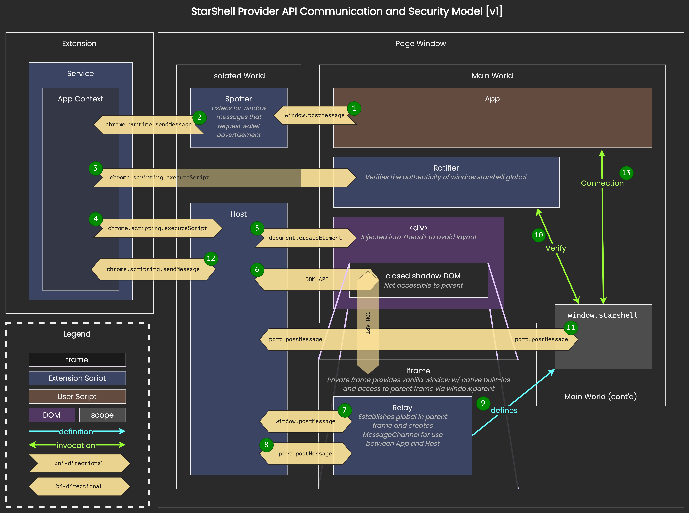

# StarShell Source Code Documentation

These documents are intended to help developers, auditors, and code reviewers read/navigate the source code understand high-level components of the project including its approaches to privacy and security.

## Getting Started

Before diving into any of the code, please see this brief note on the [Coding Conventions](variable-prefix-semantics.md) used in this project.

## Privacy and Security

All things related to the privacy and security components.

### Provider API

When a web dApp wants to read or write data from the blockchain through a wallet extension, the user is exposing themselves to a non-trivial amount of privacy and security risks.

StarShell challenges the de facto interaction paradigm that happens between web dApps and wallet extensions by engineering a process to establish the initial connection with the web dApp, allow it to request permissions, and optionally obscure sensitive information from the dApp itself.

These concepts are summarized in the following article:

[Web3 Wallets Have Serious Privacy and Security Flaws](https://medium.com/@starshellwallet/web3-wallets-have-serious-privacy-and-security-flaws-5023f8f872b1)

Put into practice, our holistic approach to protecting user privacy and mitigating against malicious co-installed extensions is represented in the following diagram:

This process is fairly complex and likely warrants further documentation.

### Private Key Management

Many popular extension wallets follow similar practices with regards to managing private key material in memory. We contest these practices as being "secure enough", especially in the face of zero-day vulnerabilities at the browser, OS or hardware levels that could expose users to variants of cold-boot attacks.

In an effort to reduce this and adjacent attack surfaces, we identify what we see as the current risks associated with the aforementioned approaches and describe a set of techniques to mitigate them in the following article:

[The Failures of Web3 Wallet Security](https://medium.com/@starshellwallet/the-failures-of-web3-wallet-security-90311631e08c)

Put into practice, we leverage the platform's native handling of private key material (which ideally persists in protected memory regions) combined with a one-time pad persisted in our application's heap memory. When the time comes to use the private key, we recombine these two halfs of the one-time pad to derive the original private key in memory for a very short period in time; long enough to use it for signing, encryption or decryption, produce a new one-time pad, and then dispose of its contents in memory by zeroing out the bytes.

When it comes to secp256k1 signing and ECDH operations, we elected to avoid the commonly-used JavaScript implementations for several reasons:
 1. they all make use of ES strings to store private key material, which cannot be reliably zeroed out. for example, V8 uses string interning and the bytes from an unreachable string can live in memory long after its use.
 2. JavaScript execution has virtually no protection against timing attacks, and constant-time cryptographic operations are ostensibly impossible to implement.

Instead, we have opted to revive a defunct open-source project that creates a WASM module from the thoroughly tested libsecp256k1 C library. Performing secp256k1 cryptography in WASM ensures that private key material can be explicitly zeroed out while also ideally [providing protection against timing attacks](https://github.com/bitcoin-core/secp256k1#implementation-details).

